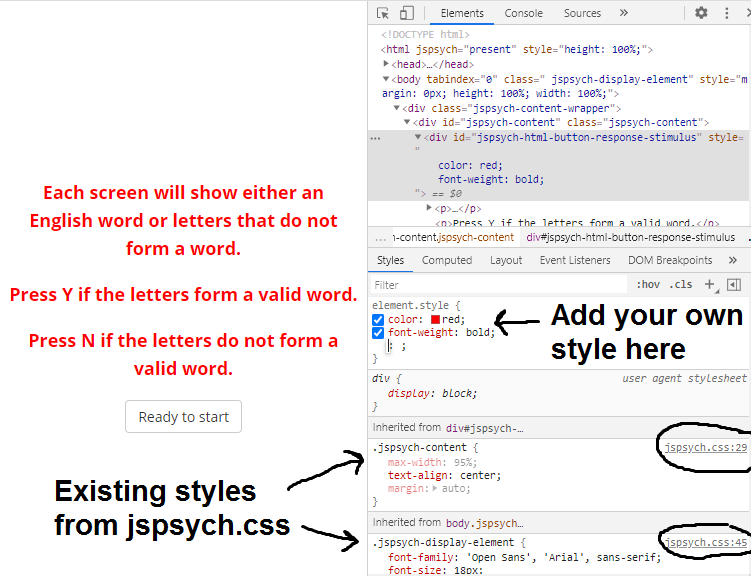
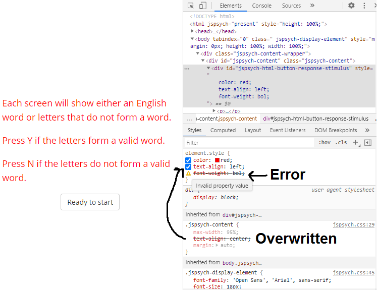

# 控制呈现样式

实验的样式由jspsych.css文件中的CSS (cascading style sheet)语句和浏览器的默认设置控制。不过，我们也可以改变实验的样式，可以根据个人偏好以及需要新样式仅对部分试次生效、对全局生效、还是对多个实验都生效。这一部分就在jsPsych中引入CSS进行讲解。更多内容也可以参考[这篇关于向网页中加入CSS的内容](https://www.w3schools.com/html/html_css.asp)。

## 内联CSS

当你使用接受HTML字符串的参数时，就可以选择使用内联CSS语句。这种方式通过["style"属性](https://www.w3schools.com/tags/att_style.asp)直接将CSS加入HTML元素中。如果你只想对试次中一个接受HTML的参数的呈现样式进行微调，可以使用这种方式。

使用内联样式时，我们需要在元素的"style"属性值中添加想要改变的CSS参数以及需要使用的值。格式为：`" &lt;parameter-name> : &lt;parameter-value> ;"`。

下面的示例中，将刺激的字体设置为30px，并将文字颜色设为红色。这些调整**只**会对当前试次中stimulus中的文字生效。

```javascript
var trial = {
	type: jsPsychHtmlKeyboardResponse,
	stimulus: '<p style="font-size:30px;color:red;">hello world!</p>'
}
```

我们也可以使用[动态参数](./dynamic-parameters.md)将CSS和根据试次变化的量结合起来。这样，我们就可以很轻松地给多个试次添加相同的内联CSS语句。下面的例子中，我们就是用动态参数和[时间线变量](./timeline.md#_5):

```javascript
var trial = {
	type: jsPsychHtmlKeyboardResponse,
	stimulus: function() {
        var stim = '<p style="font-size:30px;font-weight:bold;">'+jsPsych.timelineVariable('text')+'</p>';
        return stim;
    }
}
var trial_procedure = {
    timeline: [trial],
    timeline_variables: [
        {text: 'Welcome'},
        {text: 'to'},
        {text: 'the'},
        {text: 'experiment!'}
    ]
}
```

## 添加CSS样式表

我们可能需要对实验的CSS进行多处改变，或者在多个试次中复用我们的调整，或是将样式和HTML字符串分离开。这些时候，使用CSS样式表就比内联CSS方便多了。

创建CSS样式表和书写内联的CSS很相似，只不过在样式表中需要使用[CSS选择器](https://www.w3schools.com/css/css_selectors.asp)。这是因为我们的CSS样式表和内联样式不同，并不属于某一个HTML元素，所以我们需要告诉浏览器这些样式应该用来修饰哪些元素。格式如下：`"css-selector { &lt;parameter-name> : &lt;parameter-value> ; }"`。

下面的例子中，CSS选择器"p"告诉浏览器对所有&lt;p>标签内部的文字的字体大小进行调整。

```css
p {
  font-size: 30px;
}
```

我们使用CSS样式表也可以做一些具体调整，具体程度取决于使用的选择器。除了选择[标签名](https://www.w3schools.com/cssref/sel_element.asp) (e.g. "p")，还可以使用元素的[ID](https://www.w3schools.com/html/html_id.asp) 或 [class](https://www.w3schools.com/html/html_classes.asp)进行选择。如果使用ID选择器，则在ID前面需要加上#，如"\#stimulus"。如果使用class选择器，则需要在class前面加上.，如".large-text"。

下面的示例中，"#stimulus"选择器的含义是，只有ID为"stimulus"的元素的宽度会改变，而".large-text"选择器的含义是将所有class为"large-text"的元素的字体大小进行调整。

```css
#stimulus 
    width: 300px;
}
.large-text {
    font-size: 200%;
}
```

我们还可以创建一些更加具体的CSS选择器，例如将标签、ID和class结合起来。例如，如果我们想要给被试呈现反馈，该部分文字在&lt;p>标签内。我们可以在呈现正确反馈时将标签的ID设置为"correct"，在呈现错误反馈时将标签的ID设置为"incorrect"。然后，我们就可以分别定义两种文字的样式：

```css
p#incorrect {
  color: red;
}
p#correct {
  color: green;
}
```

关于CSS选择器详见[本页](https://www.w3schools.com/cssref/css_selectors.asp)。

### 使用style标签

我们可以将CSS样式表放在&lt;style>标签内，这些样式会对整个实验生效，有利于我们对实验整体的效果进行调整。

下面的示例中，我们将实验中默认字体大小设置为25px，这个调整会覆盖jspsych.css文件中默认的18px的字体大小。

```html
<head>
  <script src="https://unpkg.com/jspsych@latest"></script>
  <script src="https://unpkg.com/@jspsych/plugin-html-keyboard-response@latest"></script>
  <link rel="stylesheet" href="https://unpkg.com/jspsych@latest/css/jspsych.css">
  <style> 
    .jspsych-display-element {
      font-size: 25px;
    }
  </style>
</head>
```

### 引入外部CSS文件

我们可以通过外部CSS文件引入CSS样式表。我们就是这样引入jspsych.css文件的。这些样式对整个实验生效。如果我们想在多个实验（多个HTML文件）中都使用这一套样式的话，可以选择将其写在CSS文件中。

下面的示例是关于引入自定义的CSS文件和jspsych.css。其中，我们自定义的CSS文件的名称是"my_experiment_style.css"，和HTML在同一目录下。

```html
<head>
  <script src="https://unpkg.com/jspsych@latest"></script>
  <script src="https://unpkg.com/@jspsych/plugin-image-keyboard-response@latest"></script>
  <link rel="stylesheet" href="https://unpkg.com/jspsych@latest/css/jspsych.css">
  <link rel="stylesheet" href="my_experiment_style.css">
</head>
```

下面为一些外部CSS文件中的示例，比如说上面的"my_experiment_style.css"文件。这一部分的CSS文件会 (1) 将页面背景色变为黑色, (2) 将默认字体改为25px、白色, 以及 (3) 让页面内容宽度最多只能占到80%。 

```css
body {
  background-color: black;
}
.jspsych-display-element {
  font-size: 25px;
  color: white;
}
.jspsych-content {
  max-width: 80%; 
}
```

!!! note "注意"  
    不能在外部CSS文件中使用&lt;style>标签。

### 使用css_classes参数

CSS规则也可以使用`css_classes`参数设定，从而只对特定试次作用。此参数将为当前试次中呈现实验内容的&lt;div>元素添加一个或多个class名。这样，我们就可以像其他参数一样设定CSS样式。

如果我们对于某个试次一直使用相同的CSS样式，就可以以静态范式指定`css_classes`参数。在下面的'fixation'中，将样式和`stimulus`参数分开会让代码更简洁，且有助于复用该部分样式。

```html
 <head>
  <script src="https://unpkg.com/jspsych@latest"></script>
  <script src="https://unpkg.com/@jspsych/plugin-html-keyboard-response@latest"></script>
  <link rel="stylesheet" href="https://unpkg.com/jspsych@latest/css/jspsych.css">
  <style> 
    .fixation {font-size: 90px; font-weight: bold; color: gray;}
  </style>
</head>
<script>
var fixation = {
    type: jsPsychHtmlKeyboardResponse,
    stimulus: '+',
    choices: "NO_KEYS",
    trial_duration: 500,
    css_classes: ['fixation']
}
// ...
</script>
```

不过有时候，我们有可能需要`css_classes`参数在不同试次中有所不同。这个时候我们就可以改用[动态参数](./dynamic-parameters.md)或[时间线变量](./timeline.md#_5) (详见下面的示例)。

还有一点需要注意的是，`css_classes`参数只会对div#jspsych-content添加class名，该元素为实验内容中所有元素的父元素。有些时候我们需要对这些子元素的样式进行调整。一些情况下，子元素会继承CSS样式。例如，上面`fixation`的例子中，该部分的CSS样式会通过继承对内部所有的文字的字体、粗细和颜色进行调整。

但是，上面的方式并不一定适用于所有情况，原因有二：

1. 不是所有CSS属性都会继承自父元素。

2. 继承父元素的CSS时，会影响试次中**所有**的元素。

这些时候，我们就需要调整CSS选择器进行更具体的选择——可以在class名后面加一个空格，然后添加CSS选择器，以选择我们需要调整的元素。

!!! tip "小贴士"
    如果需要知道如何选择某个元素，可以（在网页中）右键点击该元素并选择“检查”，在弹出的窗口中右键点击该元素对应的属性并将选择器复制下来。如果时间不够，可以增加`trial_duration`。详见下面[使用CSS的建议](#css_3)部分。

下面的例子中，CSS选择器`.left-align #stimulus`选中了类名为"left-align"的元素内、ID为"stimulus"的元素。

```html
<head>
  <script src="https://unpkg.com/jspsych@latest"></script>
  <script src="https://unpkg.com/@jspsych/plugin-html-keyboard-response@latest"></script>
  <link rel="stylesheet" href="https://unpkg.com/jspsych@latest/css/jspsych.css">
  <style> 
    .left-align #stimulus {text-align: left; width: 600px;}
    .right-align #stimulus {text-align: right; width: 600px;}
  </style>
</head>
<script>
var trial_procedure = {
    timeline: [{
        type: jsPsychHtmlKeyboardResponse,
        stimulus: '<p id="stimulus">This is the stimulus.</p>',
        prompt: '<p>This text will not be affected by the CSS classes '+
            'because it does not have the "stimulus" ID.</p>',
        css_classes: jsPsych.timelineVariable('css_classes')
    }],
    timeline_variables: [
        {css_classes: ['left-align']},
        {css_classes: ['right-align']}
    ]
}
// ...
</script>
```

我们可以通过`css_classes`参数添加多个class，这有助于我们对不同样式进行组合。下面的示例中，我们将两种文字对齐方式和两种文字颜色进行了四种不同组合：

```html
<head>
  <script src="https://unpkg.com/jspsych@latest"></script>
  <script src="https://unpkg.com/@jspsych/plugin-html-keyboard-response@latest"></script>
  <link rel="stylesheet" href="https://unpkg.com/jspsych@latest/css/jspsych.css">
  <style> 
    .left-align #stimulus {text-align: left; width: 600px;}
    .right-align #stimulus {text-align: right; width: 600px;}
    .teal #stimulus {color: teal;}
    .purple #stimulus {color: purple;}
  </style>
</head>
<script>
var trial_procedure = {
    timeline: [{
        type: jsPsychHtmlKeyboardResponse,
        stimulus: '<p id="stimulus">This is the stimulus.</p>',
        prompt: '<p>This text will not be affected by the CSS classes '+
            'because it does not have the "stimulus" ID.</p>',
        css_classes: jsPsych.timelineVariable('css_classes'),
        data: {condition: jsPsych.timelineVariable('condition')}
    }],
    timeline_variables: [
        {css_classes: ['left-align','teal'], condition: 'left-teal'},
        {css_classes: ['right-align','teal'], condition: 'right-teal'},
        {css_classes: ['left-align','purple'], condition: 'left-purple'},
        {css_classes: ['right-align','purple'], condition: 'right-purple'}
    ]
}
// ...
</script>
```

更多说明和示例详见jsPsych的examples文件夹下的"css-classes-parameter.html"文件。

## 使用CSS的建议

浏览器的开发者工具包含了很多开发、debug实验样式的功能。我们可以打开开发者工具，然后点击"Elements"选项。选中某个元素后，就可以看到可以用来选中该元素的信息，包括：

1. 标签名。如"div", "p", "img", "button"
2. ID，如果有的话
3. class，如果有的话

我们可以用这些来创建一个CSS选择器，以对该元素的样式进行修改。


如我们所见，jsPsych给很多元素已经添加了ID和class。我们可以使用开发者工具查看我们想要修饰的元素是不是已经有ID和class了，此时我们就不用自己手动添加了。比如说，"html-keyboard-response"插件中，刺激会呈现在一个ID为"jspsych-html-keyboard-response-stimulus"的&lt;div>内，所以我们可以像下面这样添加一个修饰所有"html-keyboard-response"的刺激的CSS样式：

```css
#jspsych-html-keyboard-response-stimulus {
  color: white;
  background-color: blue;
  width: 100px;
  border: 4px solid black;
}
```

再举一个例子。jsPsych中多数按钮的类名都包含"jspsych-btn"，我们可以通过这个类名改变默认的按钮样式：

```css
.jspsych-btn {
  padding: 20px 20px;
  font-size: 25px;
  border-color: black;
}
```

我们还可以使用开发者工具来更改元素的CSS，并实时看到变化。这些变化只是暂时的，所以我们还是需要使用上述方法对实验中的CSS进行更改。但是，在开发者工具中进行调整有助于我们确定要更改哪些CSS属性以及所要使用的值。开发者工具的这一部分还显示了当前应用于元素的样式及来源：





对CSS进行debug的时候需要注意几件事：

1. 如果有冲突的CSS样式，则需要考虑到优先级。例如，内联的CSS优先级最高，而更具体的CSS选择器优先级一般高于不那么具体的选择器。
2. 如果冲突的CSS样式优先级相同，则使用最后声明的样式。因此，我们需要在磨人的jspsych.css文件后面引入自己的css文件。详见[CSS优先级](https://www.w3schools.com/css/css_specificity.asp)。

如果某条CSS样式被另一条覆盖掉了，则开发者工具中该条样式会出现<s>中划线</s>。此外，如果使用了错误的CSS属性名或属性值，则会报错，同时呈现<s>中划线</s>和黄色的警告标志。




